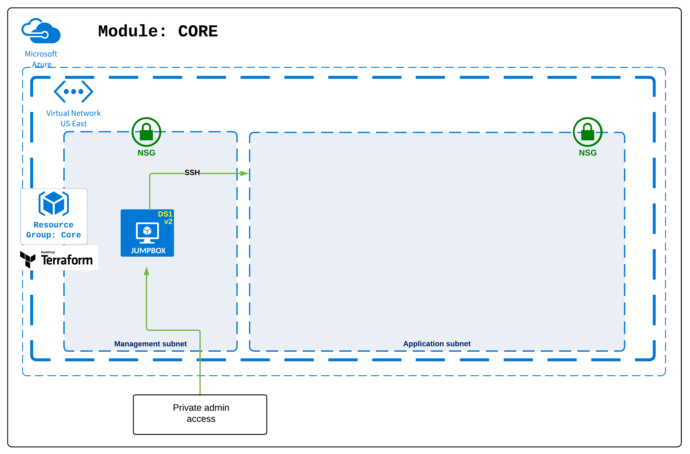
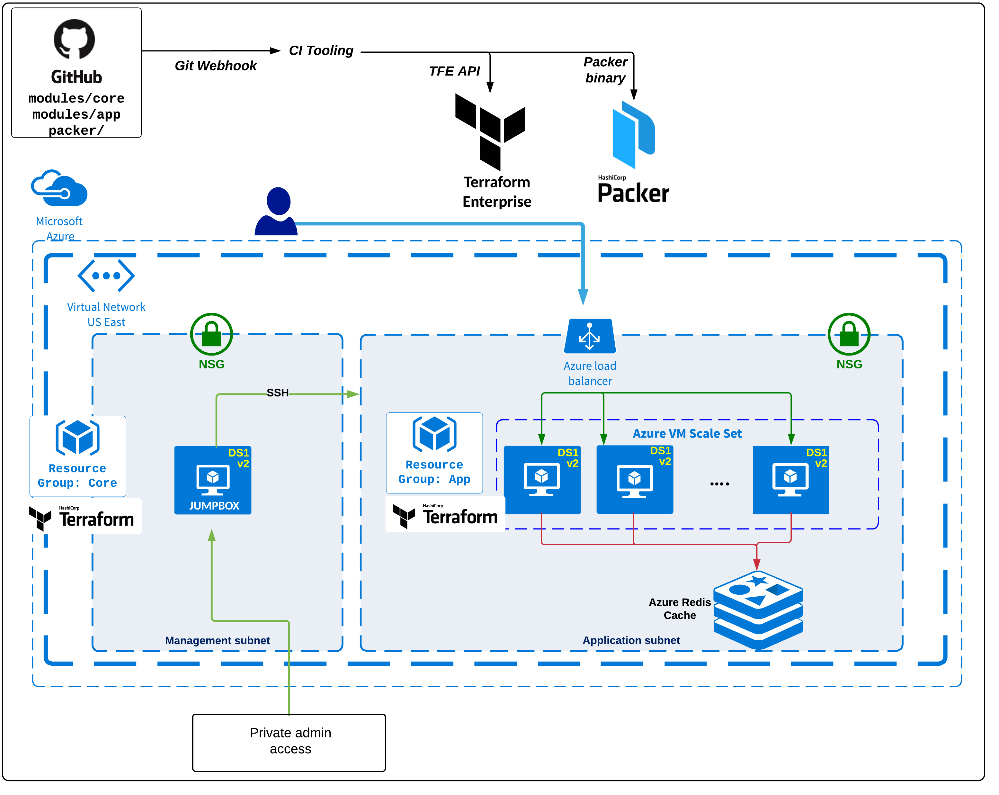

## terraform-azure-vmss-module-core
Terraform Core module for use with a Terraform Enterprise Private Module Repository. This module provisions an Azure VNET, Subnet and Bastion Host.
- Dependency: None
- Example: see example instantiation in [examples/simple/main.tf](examples/simple/main.tf)

### Jenkins build steps:
Please see [Jenkins README](../../jenkins/README.md).

### TFE-CLI local build steps:
- Ensure [TFE CLI](https://github.com/hashicorp/tfe-cli/projects) is installed:
  - You may use the example commands below to setup tfe in INSTALL_DIR:
```
export TFE_INSTALL_DIR=/tmp
cd ${TFE_INSTALL_DIR}
git clone git@github.com:hashicorp/tfe-cli.git
cd tfe-cli/bin
ln -s $PWD/tfe /usr/local/bin/tfe
```
- Edit [app-example.sh](app-example.sh) with the correct values for these variables: `TFE_ORG, ID_RSA_PUB_PATH, ARM_SUBSCRIPTION_ID, ARM_CLIENT_ID, ARM_CLIENT_SECRET, ARM_TENANT_ID`
- Invoke the script:
```
chmod +x app-example.sh
./app-example.sh
```

### Core Module diagram:


### Terraform Azure VMSS architecture diagram:

